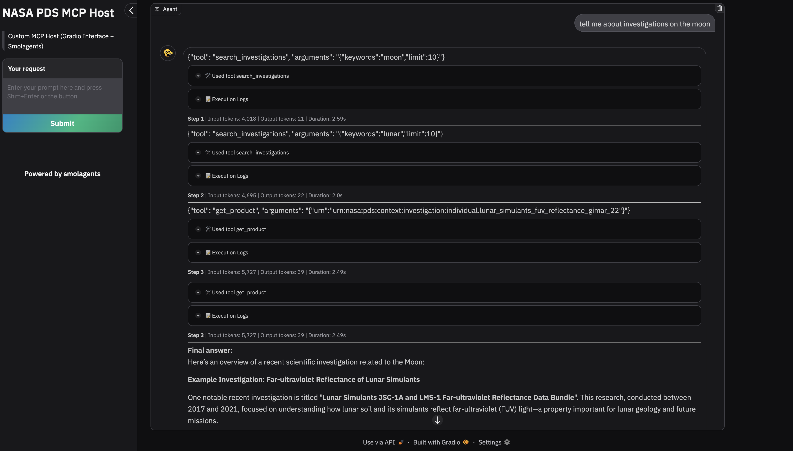

# Gradio UI for NASA PDS MCP Server

This directory contains the Gradio-based web interface for interacting with the NASA Planetary Data System (PDS) MCP server. The interface provides an intuitive chat-based UI for exploring NASA PDS data through an AI agent powered by HuggingFace's smolagents library.



## Overview

A simplified Gradio application specifically configured for the NASA PDS MCP server:

- **MCP Integration**: Direct integration with the PDS MCP server using smolagent's `MCPClient`
- **Tool Discovery**: Automatically discovers and loads available PDS tools
- **OpenAI Integration**: Uses OpenAI's GPT-4.1 model for agent reasoning
- **Streaming Support**: Real-time response streaming for better user experience

**Configuration:**

- Uses environment variables for Python path and MCP server path
- Configures agent with PDS-specific prompt templates
- Enables API key input for secure model access
- Sets up proper MCP client connection and cleanup

## Usage

### Prerequisites

1. Install required dependencies from `requirements.txt`

2. Set up environment variables in a `.env` file:

```env
PYTHON_PATH=/path/to/your/python
MCP_SERVER_PATH=/path/to/pds_mcp_server.py
OPENAI_API_KEY=your_openai_api_key_here
```

### Running the Gradio Interface

```bash
python hf_gradio-pds.py
```

## Customization

### Modifying the Agent

The `hf_gradio-pds.py` file can be customized to:

- Change the model (modify `model_id` in `OpenAIServerModel`)
- Adjust agent parameters (max_steps, streaming options)
- Modify prompt templates for different use cases and instructions

### UI

The `GradioUI` is originally a pre-built [smolagents component](https://github.com/huggingface/smolagents/blob/main/src/smolagents/gradio_ui.py). It has already been altered here in `gradio_smolagents_ui.py`. Feel free to alter it more for your use case.

## Technical Details

### Architecture

- **Frontend**: Gradio web interface with real-time updates (customized from HuggingFace's [GradioUI](https://github.com/huggingface/smolagents/blob/main/src/smolagents/gradio_ui.py) component)
- **Backend**: smolagents framework with MCP client integration
- **Data Source**: NASA PDS Registry API via MCP server
- **Model**: OpenAI GPT-4.1 (can be configured to any model provider HuggingFace supports)


## Troubleshooting

### Common Issues

1. **API Key Not Working**

   - Ensure the API key is valid and has sufficient credits
   - Check that the key is properly entered in the UI
   - Verify the key has access to the required model

2. **MCP Server Connection Issues**

   - Verify the MCP server path in environment variables
   - Ensure the MCP server is running and accessible
   - Check Python path configuration
